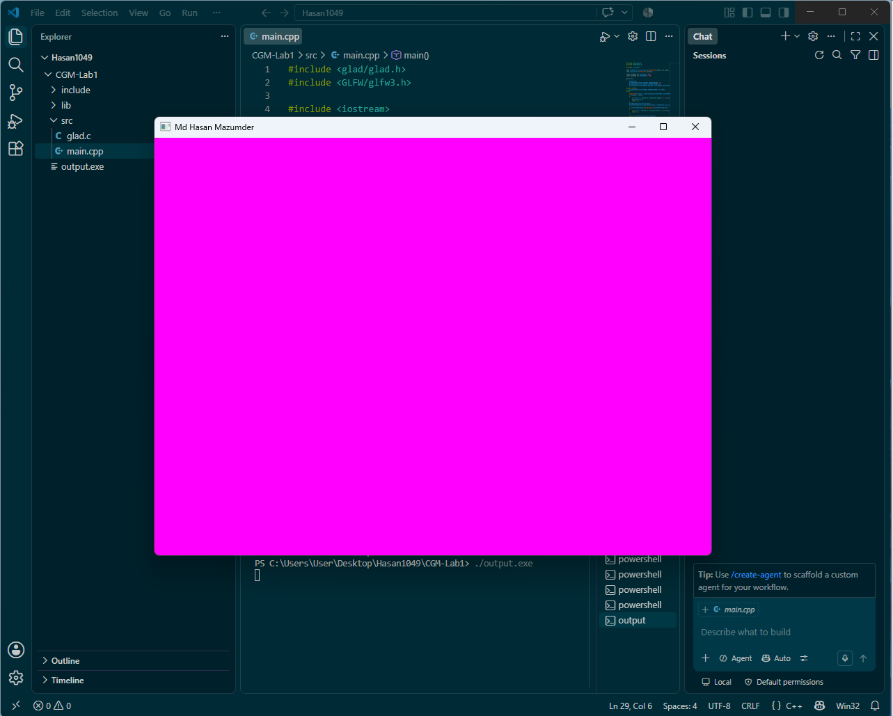

# CGM Lab Assignment 1

**Course:** CSE 0611328 – Computer Graphics and Multimedia Lab (Autumn 26)
**Name:** Md Hasan Mazumder
**Student ID:** 0432410005101049
**Section:** 6A2

## Description
This program creates a magenta-colored GLFW window titled "Md Hasan Mazumder".
Pressing the 'M' key (first letter of the name) closes the window.

## Tools Used
- GLFW 3.x
- GLAD (OpenGL 3.3 Core)
- MinGW-w64 (g++)

## How to Compile & Run
g++ main.cpp glad.c -I../../include -L../../lib -lglfw3 -lgdi32 -lopengl32 -o output.exe
./output.exe

## Output

