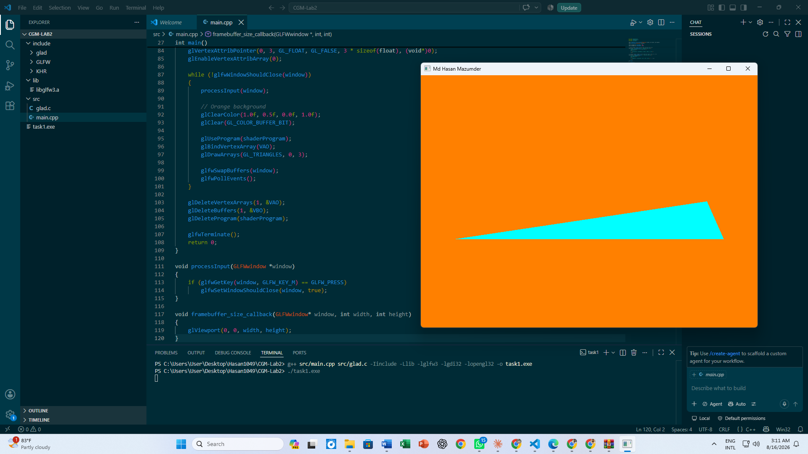
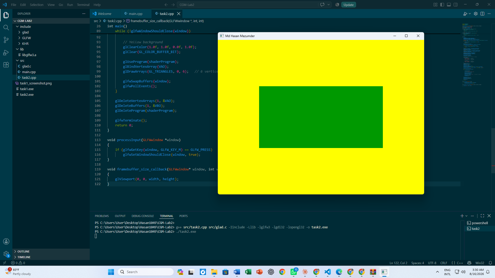

# CGM Lab Assignment 2

**Course:** CSE 0611328 – Computer Graphics and Multimedia Lab (Autumn 26)
**Name:** Md Hasan Mazumder
**Student ID:** 0432410005101049
**Section:** 6A2

## Description
Two OpenGL tasks using GLFW/GLAD. Both windows are titled "Md Hasan Mazumder"
and close when the 'M' key (first letter of the name) is pressed.

### Task 1 — Obtuse Triangle
Draws a cyan-colored obtuse triangle on an orange background.
File: `main.cpp`

### Task 2 — Rectangle
Draws a green rectangle (not a square) using 6 vertices (2 triangles)
on a yellow background.
File: `task2.cpp`

## Tools Used
- GLFW 3.x
- GLAD (OpenGL 3.3 Core)
- MinGW-w64 (g++)

## How to Compile & Run

**Task 1:**
g++ main.cpp glad.c -I../../include -L../../lib -lglfw3 -lgdi32 -lopengl32 -o task1.exe
./task1.exe

**Task 2:**
g++ task2.cpp glad.c -I../../include -L../../lib -lglfw3 -lgdi32 -lopengl32 -o task2.exe
./task2.exe

## Output

### Task 1 — Obtuse Triangle

### Task 2 — Rectangle

