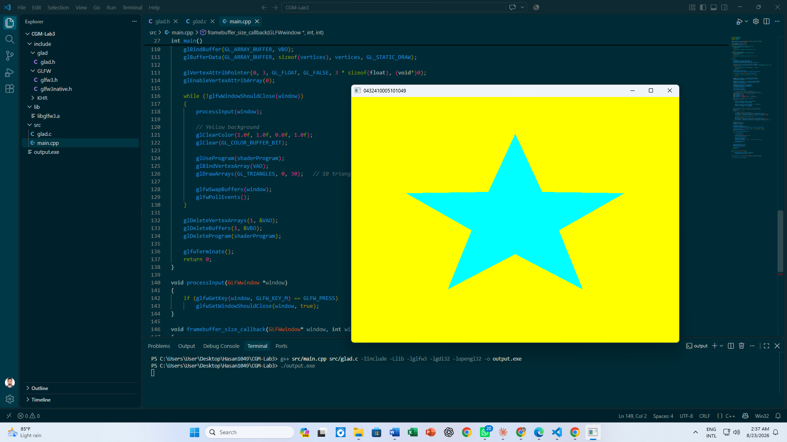

# CGM Lab Assignment 3

**Course:** CSE 0611328 – Computer Graphics and Multimedia Lab (Autumn 26)
**Name:** Md Hasan Mazumder
**Student ID:** 0432410005101049
**Section:** 6A2

## Description
This program draws a cyan-colored 5-pointed star (built only with triangles)
on a yellow background using GLFW/GLAD. The window title displays the student ID
"0432410005101049" and closes when the 'M' key (first letter of the name) is pressed.

## Star Construction
The star is built entirely from triangles — no other primitive is used.
It has 10 outer/inner points (5 spikes + 5 inner corners) around a center point.
Each spike is formed by 2 triangles sharing the center, giving 10 triangles total
(30 vertices) that together form the star shape.

## Tools Used
- GLFW 3.x
- GLAD (OpenGL 3.3 Core)
- MinGW-w64 (g++)

## How to Compile & Run
g++ main.cpp glad.c -I../../include -L../../lib -lglfw3 -lgdi32 -lopengl32 -o output.exe
./output.exe

## Output

