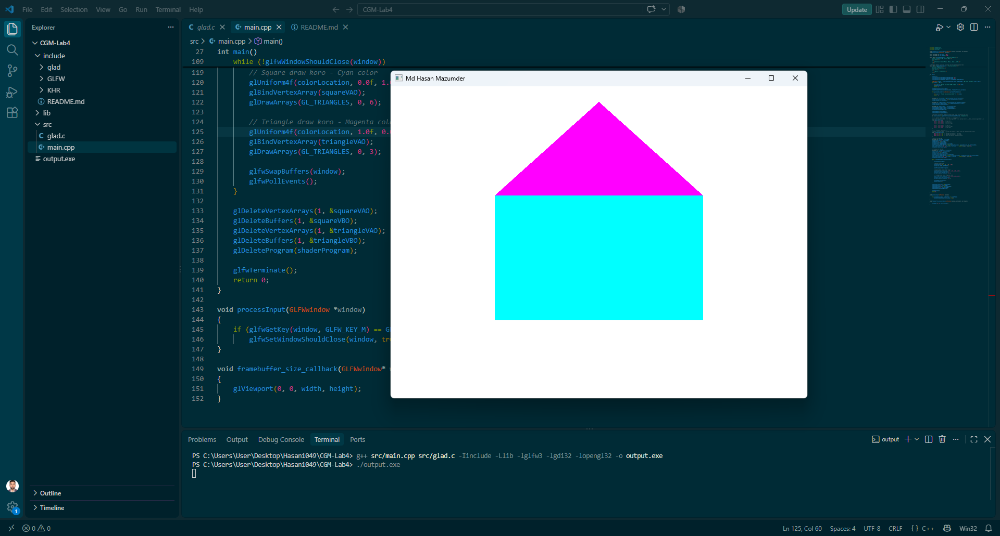

# CGM Lab Assignment 4

**Course:** CSE 0611328 – Computer Graphics and Multimedia Lab (Autumn 26)
**Name:** Md Hasan Mazumder
**Student ID:** 0432410005101049
**Section:** 6A2

## Description
This program displays a cyan-colored square on a white background using GLFW/GLAD.
A magenta triangle is placed on top of the square, sharing the square's two top
corner points (top-left and top-right). The window title displays the full name
"Md Hasan Mazumder" and closes when the 'M' key (first letter of the name) is pressed.

## Implementation Notes
- The square is built from 2 triangles (6 vertices).
- The triangle shares its two base vertices exactly with the square's top-left
  and top-right corners, and has a third apex point above them.
- Both shapes use the same shader program; color is passed in via a `uniform`
  variable (`shapeColor`) so each shape can be drawn in a different color.

## Tools Used
- GLFW 3.x
- GLAD (OpenGL 3.3 Core)
- MinGW-w64 (g++)

## How to Compile & Run
g++ main.cpp glad.c -I../../include -L../../lib -lglfw3 -lgdi32 -lopengl32 -o output.exe
./output.exe

## Output

